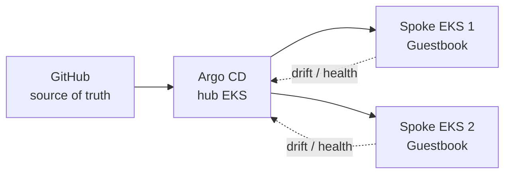

<div align="center">


<p><strong>DevOps Engineer building reliable cloud infrastructure and automated delivery systems.</strong></p>

<br/>


</div>

<br/>

<picture>
  <source media="(prefers-color-scheme: dark)" srcset="dark.svg">
  <source media="(prefers-color-scheme: light)" srcset="light.svg">
  
</picture>

<br/>


## `// 01_ABOUT.sys`

```yaml
> initializing profile...
role       : Final-Year E&TC Undergraduate · Freelance Data Developer
core_focus : DevOps ⋅ Cloud Infrastructure ⋅ Data Engineering
experience : AWS Cloud ⋅ CI/CD Automation ⋅ Containerization ⋅ DevSecOps ⋅ IaC
side_quest : Power BI / Tableau freelance developer since 2022
learning[] : Terraform modules, AWS security patterns
seeking    : DevOps / Cloud / Data Engineering internship or entry-level role
contact    : kalekartik2004@gmail.com
> profile loaded successfully ✔
```

### `CURRENTLY_BUILDING`

`Terraform modules` &nbsp; `Secure CI/CD pipelines` &nbsp; `Observable workloads`

<br/>

## `// 02_TECH_STACK.dashboard`

<div align="center">

<table>
<tr>
<td align="center"><strong>CLOUD</strong></td>
<td>
  <code>AWS</code>
  <code>EC2</code>
  <code>S3</code>
  <code>Lambda</code>
  <code>CloudFront</code>
  <code>Route 53</code>
  <code>RDS</code>
  <code>IAM</code>
</td>
</tr>
<tr>
<td align="center"><strong>DEVOPS</strong></td>
<td>
  <code>Docker</code>
  <code>Jenkins</code>
  <code>GitHub Actions</code>
  <code>Terraform</code>
  <code>CloudFormation</code>
</td>
</tr>
<tr>
<td align="center"><strong>OBSERVABILITY</strong></td>
<td>
  <code>Prometheus</code>
  <code>Grafana</code>
  <code>Alertmanager</code>
  <code>CloudWatch</code>
</td>
</tr>
<tr>
<td align="center"><strong>TOOLS</strong></td>
<td>
  <code>Python</code>
  <code>Bash</code>
  <code>PostgreSQL</code>
  <code>Linux</code>
  <code>Git</code>
  <code>Kubernetes</code>
</td>
</tr>
</table>

</div>

<br/>

## `// 03_LIVE_METRICS.dashboard`

<div align="center">

<a href="https://github.com/Kartik-IN?tab=repositories"></a>
<a href="https://github.com/Kartik-IN?tab=followers"></a>
<a href="https://github.com/Kartik-IN/Kartik-IN/commits/main"></a>
<a href="https://github.com/Kartik-IN/Kartik-IN"></a>

</div>

<br/>

## `// 04_FEATURED_DEPLOYMENTS.projects`

<!-- PROJECTS:START -->
<table width="100%">
<tr>
<td width="33%" valign="top">

### [🔎 Actions Log Analyzer](https://github.com/Kartik-IN/github-actions-log-analyzer)
`PYTHON · CLI · API`

Local-first, explainable analysis for failed GitHub Actions jobs.

- Deterministic failure classification
- Evidence and investigation steps
- Local logs or GitHub REST API mode

<a href="https://github.com/Kartik-IN/github-actions-log-analyzer"></a>
<a href="https://github.com/Kartik-IN/github-actions-log-analyzer/actions/workflows/ci.yml"></a>

</td>
<td width="33%" valign="top">

### [☸️ Multi-Cluster GitOps](https://github.com/Kartik-IN/multi-cluster-gitops)
`AWS EKS · ARGO CD · K8S`

Hub-and-spoke delivery across two EKS clusters, with GitHub as the source of truth.

- Declarative application sync
- Drift detection and self-healing
- Operator-controlled AWS resources

<a href="https://github.com/Kartik-IN/multi-cluster-gitops"></a>

</td>
<td width="33%" valign="top">

### [🛡️ DevSecOps Node App](https://github.com/Kartik-IN/devsecops-nodejs-app)
`JENKINS · DOCKER · AWS`

Production-style delivery pipeline for a Node.js application.

- Automated build and security scanning
- DockerHub image publishing
- AWS EC2 deployment via webhooks

<a href="https://github.com/Kartik-IN/devsecops-nodejs-app"></a>

</td>
</tr>
</table>
<!-- PROJECTS:END -->

<br/>

### `ARCHITECTURE_SPOTLIGHT`



<br/>

## `// 05_CERTIFICATIONS.log`

<div align="center">


</div>

<br/>

## `// 06_CONTRIBUTION_MATRIX.grid`

<div align="center">


<br/><br/>

<picture>
  <source media="(prefers-color-scheme: dark)" srcset="https://raw.githubusercontent.com/Kartik-IN/Kartik-IN/output/github-contribution-grid-snake-dark.svg">
  <source media="(prefers-color-scheme: light)" srcset="https://raw.githubusercontent.com/Kartik-IN/Kartik-IN/output/github-contribution-grid-snake.svg">
  
</picture>

<sub>Animated daily contribution activity, generated by GitHub Actions.</sub>
</div>

<br/>

## `// 07_UPLINK.connect`

<div align="center">

<a href="https://github.com/Kartik-IN"></a>
<a href="https://www.linkedin.com/in/kartik-kale/"></a>
<a href="mailto:kalekartik2004@gmail.com"></a>

<br/><br/>


</div>


