<div align="center">


<br/>


</div>

<br/>

<picture>
  <source media="(prefers-color-scheme: dark)" srcset="dark.svg">
  <source media="(prefers-color-scheme: light)" srcset="light.svg">
  
</picture>

<br/>


## `// 01_ABOUT.sys`

```yaml
> initializing profile...
role       : Final-Year E&TC Undergraduate · Freelance Data Developer
core_focus : DevOps ⋅ Cloud Infrastructure ⋅ Data Engineering
experience : AWS Cloud ⋅ CI/CD Automation ⋅ Containerization ⋅ DevSecOps ⋅ IaC
side_quest : Power BI / Tableau freelance developer since 2022
learning[] : Terraform modules, AWS security patterns
seeking    : DevOps / Cloud / Data Engineering internship or entry-level role
contact    : kalekartik2004@gmail.com
> profile loaded successfully ✔
```

<br/>

## `// 02_TECH_STACK.dashboard`

<div align="center">

<table>
<tr>
<td align="center"><strong>CLOUD</strong></td>
<td>
  <code>AWS</code>
  <code>EC2</code>
  <code>S3</code>
  <code>Lambda</code>
  <code>CloudFront</code>
  <code>Route 53</code>
  <code>RDS</code>
  <code>IAM</code>
</td>
</tr>
<tr>
<td align="center"><strong>DEVOPS</strong></td>
<td>
  <code>Docker</code>
  <code>Jenkins</code>
  <code>GitHub Actions</code>
  <code>Terraform</code>
  <code>CloudFormation</code>
</td>
</tr>
<tr>
<td align="center"><strong>OBSERVABILITY</strong></td>
<td>
  <code>Prometheus</code>
  <code>Grafana</code>
  <code>Alertmanager</code>
  <code>CloudWatch</code>
</td>
</tr>
<tr>
<td align="center"><strong>TOOLS</strong></td>
<td>
  <code>Python</code>
  <code>Bash</code>
  <code>PostgreSQL</code>
  <code>Linux</code>
  <code>Git</code>
  <code>Kubernetes</code>
</td>
</tr>
</table>

</div>

<br/>

## `// 03_LIVE_METRICS.dashboard`

<div align="center">


</div>

<br/>

## `// 04_FEATURED_DEPLOYMENTS.projects`

<table width="100%">
<tr>
<td width="33%" valign="top">

### 🛰️ Three-Tier AWS Architecture
`STATUS: PRODUCTION-GRADE`

Multi-AZ infrastructure engineered for real fault tolerance.

- ⚡ Multi-AZ VPC design
- ⚡ ALB + NLB + Auto Scaling
- ⚡ Private RDS subnet
- ⚡ CloudFront + Route53
- ⚡ IAM least-privilege security

</td>
<td width="33%" valign="top">

### 🔐 DevSecOps CI/CD Pipeline
`STATUS: SECURITY-HARDENED`

End-to-end pipeline with security gates at every stage.

- ⚡ Jenkins orchestration
- ⚡ SonarQube static analysis
- ⚡ Trivy vulnerability scans
- ⚡ Docker image builds
- ⚡ GitHub Webhooks → AWS EC2

</td>
<td width="33%" valign="top">

### ⚡ Serverless Event-Driven System
`STATUS: REAL-TIME`

Fully serverless architecture reacting to events instantly.

- ⚡ AWS Lambda functions
- ⚡ S3-triggered workflows
- ⚡ SNS fan-out messaging
- ⚡ CloudWatch observability
- ⚡ Written in Python

</td>
</tr>
</table>

<br/>

## `// 05_CERTIFICATIONS.log`

<div align="center">


</div>

<br/>

## `// 06_CONTRIBUTION_MATRIX.grid`

<div align="center">


<sub>The contribution snake will appear from the <code>output</code> branch after the workflow runs.</sub>
</div>

<br/>

## `// 07_UPLINK.connect`

<div align="center">

<a href="https://github.com/Kartik-IN"></a>
<a href="https://www.linkedin.com/in/kartik-kale/"></a>
<a href="mailto:kalekartik2004@gmail.com"></a>

<br/><br/>


</div>


